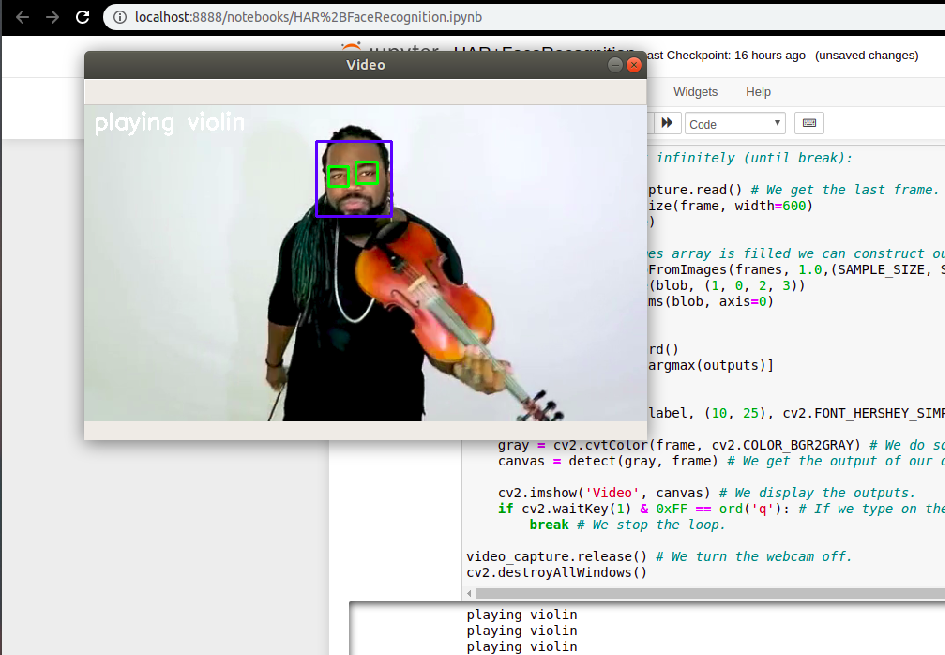

# HumanActivityRecognition
This moduel will include two things ( Human activity Recognition + face identification ) in real time

After cloning this repo
download a video and save that video in the current working directory with the file name as example.mp4 

The resnet weights on the Kinetics dataset are used in this repo.

# To Run this Project execute the ipython notebook:
      
      HAR+FaceRecognition.ipynb

**To Run only Human Activity Recognition File use command:**

      python3 Human_activity_Recog.py 
      
**To Run only Face Detection file, use command:**

      python3 face_recognition_using_open_cv.py
      
 Then you would get result like
 
 
 
**Requirements:**
      
      python3
      numpy
      cv2
      imutils
      sys
      os

To upload larger file to your repo
use : 

      git lfs track "*.onnx"  (i.e file type)
      
then normally proceed with 

      git add .
      
      git commit -m "message"
      
      git push
